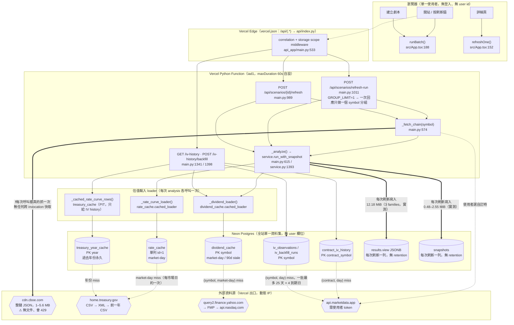
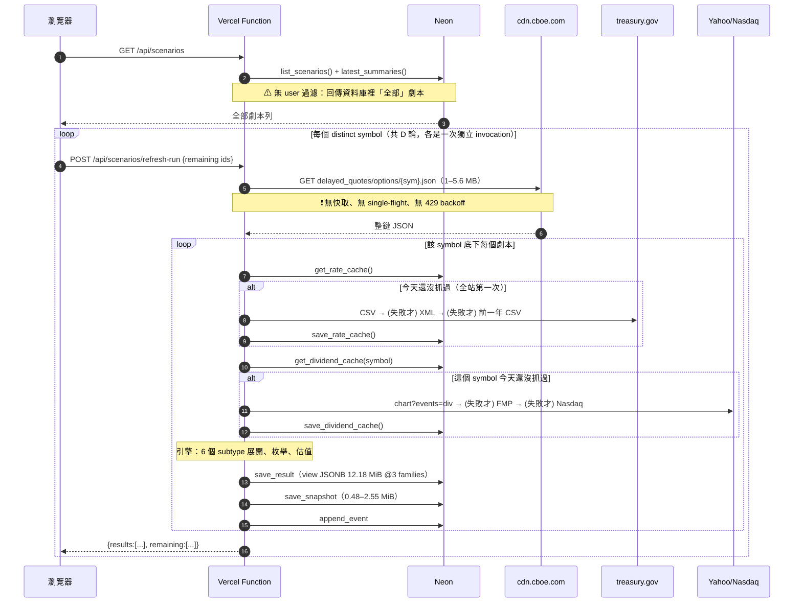
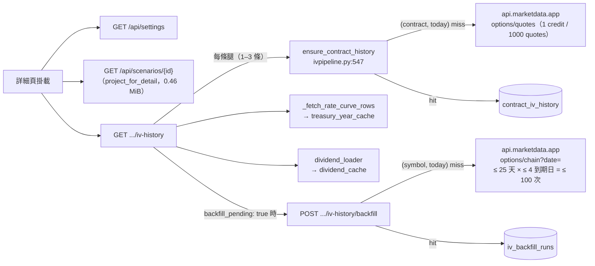

# Market Data 現況地圖（Current-State Map）

研究日期：2026-09-03。對應 **OPTION-MARKET-DATA-RESEARCH-001**。
基準：`origin/master` HEAD `864dd5c`（工作樹 `b41ad1c`，已核對與 master
production code 逐位元相同）。

本檔只畫「現在實際長什麼樣」，**不含任何建議**——建議與風險分級見
`market-data-lifecycle-scaling.md`。每個框都可回推到具體檔案與行號。

---

## 1. 全景圖



---

## 2. 邊界標註

### 2.1 Request boundary（一次 HTTP request 的範圍）

| 邊界 | 內容 | 依據 |
|---|---|---|
| 一次 `refresh-run` HTTP request | **恰好一個 symbol 分組**（`REFRESH_RUN_GROUP_LIMIT = 1`），其餘進 `remaining`，由前端 Continuation 迴圈再打一次 | `main.py:80`、`main.py:1083`、`src/App.tsx:196-253` |
| 一次 `refresh` HTTP request | 恰好一個劇本、一次抓鏈 | `main.py:989-1009` |
| Storage 連線 | 一個 request 共用一條 Neon 連線（`contextvars`，惰性開啟） | `main.py:533`、`storage/postgres.py:356` |
| Diagnostics | per-request 緩衝，結束時才依優先序落盤，且只有 `warning`／`error` 寫庫 | `main.py:1215-1233` |
| Chain 記憶體去重 | **只在這一次 invocation 內**，且因 GROUP_LIMIT=1 實際等同「同一 symbol 的多個劇本」 | `docs/adr/0001`、`main.py:1073-1096` |

### 2.2 Cache boundary（快取住在哪、鍵是什麼、活多久）

| 快取 | 位置 | 鍵 | 新鮮度 | 跨 invocation | 跨使用者 |
|---|---|---|---|---|---|
| `rate_cache` | Neon 單列 | 無（全站一筆） | `market_day == today`；失敗 5 分鐘窗；7 天 stale fallback | ✅ | ✅（今天無 user 概念） |
| `dividend_cache` | Neon | `symbol` | 同上，但 stale fallback 90 天 | ✅ | ✅ |
| `treasury_year_cache` | Neon | `year` | 過去年份**永久**；當年 market-day | ✅ | ✅ |
| `contract_iv_history` | Neon | `contract_symbol`（OCC） | `last_attempt_on == today` 就不再打 vendor | ✅ | ✅ |
| `iv_backfill_runs` | Neon | `symbol` | `ran_on == today` 就不再跑 | ✅ | ✅ |
| **Option chain** | **不存在** | — | — | ❌ | ❌ |
| Treasury 本地檔案快取 | `snapshots/*.json` | — | 7 天 | ❌ **production 死碼**（Vercel FS 唯讀，`_write_cache` 吞 `OSError`） | ❌ |
| 配息本地檔案快取 | `snapshots/*.json` | `symbol` | 90 天 | ❌ **production 死碼**（同上） | ❌ |
| 前端 `fetchCache` | 瀏覽器記憶體 | `(id, analyzed_at)` 等 | 參照計數，掛載期間 | ❌ | ❌（per-tab） |

### 2.3 Shared / non-shared

```
全站共用（今天就是 system-wide，因為沒有 user 隔離）
  ├── rate_cache            ← 天生就是 shared-data 架構
  ├── treasury_year_cache   ← 天生就是 shared-data 架構
  ├── dividend_cache        ← per-symbol，天生可跨使用者共用
  ├── contract_iv_history   ← per-contract，天生可跨使用者共用
  ├── iv_observations       ← per-symbol，天生可跨使用者共用
  ├── provider_credentials  ← ⚠ 全站一把 token（無 user 欄位）
  └── scenarios / results / snapshots  ← ⚠ 全站一份清單（無 user 欄位）

完全不共用
  └── option chain          ← 每一次「劇本 × 刷新」各抓一次全鏈
```

### 2.4 External call points（真正對外發出請求的唯四處）

| # | 位置 | 目的地 | 觸發頻率（現況） |
|---|---|---|---|
| 1 | `main.py:574 _fetch_chain` → `service.fetch_chain` → `data/cboe.py:95` | `cdn.cboe.com` | **每個 (symbol 分組 × refresh-run 請求)**，零快取 |
| 2 | `service.py:56 default_rate_curve_loader` → `data/treasury.py:80` | `home.treasury.gov` | 每市場日約 1 次（全站） |
| 3 | `service.py:61 default_dividend_loader` → `data/dividends.py:67` | `query2.finance.yahoo.com` → FMP → `api.nasdaq.com` | 每 (symbol, 市場日) 1 次（全站） |
| 4 | `ivpipeline.py` → `providers.py:107/131` → `data/marketdata.py` | `api.marketdata.app` | 每 (contract, 日) 1 次；backfill 每 (symbol, 日) 一批 ≤ 25 天 × ≤ 4 到期日 |

`data/yf.py`（yfinance 備援）**在 production 結構上不可達**：`yfinance`
不在 `pyproject.toml` 的 `[project] dependencies` 裡，只在 `yf` extra
（`pyproject.toml:30`），而 Vercel 只裝 `dependencies`——`import yfinance`
必 `ImportError`，被 `data/yf.py:63` 收斂成 `FetchError`。

---

## 3. 一次「開站刷新」的完整時序（現況，D 個 distinct symbol）



---

## 4. 詳細頁（Historical IV）的額外外部呼叫



閘門：Historical IV 未解鎖（未選自訂 provider 或 token 未驗證通過）時，
`_iv_history_gate()` 直接 403，**一個 vendor 請求都不發**
（`main.py:1258-1278`）。

---

## 5. 一句話總結

> **Treasury、Dividend、Historical IV 這三條線今天已經是 shared-data
> 架構**（Neon 為底、per-key、跨 invocation、跨使用者共用）；
> **Option Chain 這條線完全沒有共用機制**——它是唯一「使用者數量直接
> 乘上 vendor request 數量」的資料流，而且它同時是量體最大（1–5.6 MB）、
> 頻率最高、且上游會 429 的那一條。
